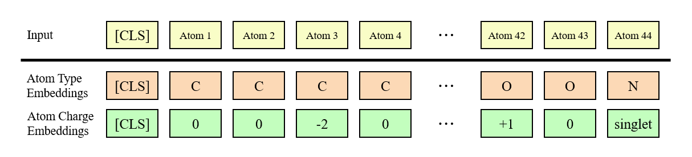
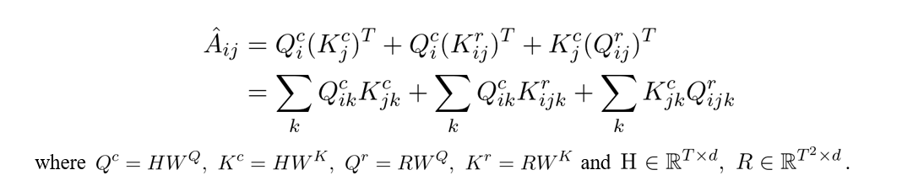
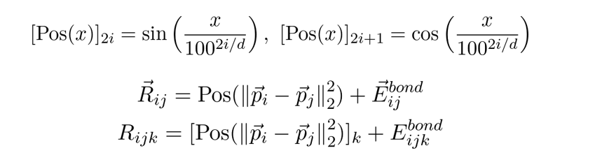
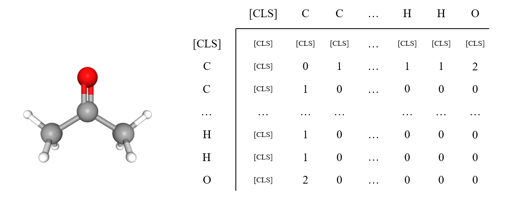

# MoT - Molecular Transformer
**Large-scale Pretraining for Molecular Property Prediction**

## Samsung AI Challenge for Scientific Discovery
This repository is an official implementation of a model which won first place in the [Samsung AI Challenge for Scientific Discovery](https://dacon.io/competitions/official/235789/overview/description) competition and was introduced at [SAIF 2021](https://www.sait.samsung.co.kr/saithome/event/saif2021.do). The result of the challenge was announced at [this video](https://www.youtube.com/watch?v=YRbFDThaAmo#t=2h57m17s).

## Introduction
MoT is a transformer-based model for predicting molecular properties from its 3D molecular structure. It was first introduced to calculate the excitation energy gap between S1 and T1 states by the molecular structure.

## Requirements
Before running this project, you need to install the below libraries:
* numpy
* pandas
* torch==1.9.0+cu111
* tqdm
* wandb
* dataclasses
* requests
* omegaconf
* pytorch_lightning==1.4.8
* rdkit-pypi
* scikit_learn

This project supports [NVIDIA Apex](https://github.com/NVIDIA/apex). It will be automatically detected and used to accelerate training when installed. apex reduces the training time up to **50%**.

[setup.sh](/setup.sh) helps installing necessary libraries, including apex. It installs the requirements and apex at once. You can simply run the script as follows:
```shell
$ bash setup.sh
```

## About Molecular Transformer
There are many apporaches to predict the molecular properties. However, for the case of calculating excitation energy gaps (e.g. between S1 to T1 states), it is necessary to consider the entire 3D structure and the charge of atoms in the compound. But many transformer-based molecular models use SMILES (or InChI) format. We also tried text-based methods in the competition, but the graph-based models showed better performance.

The important thing is to consider all connections between the atoms in the compound. However, the atoms are placed in 3D coordinate system, and it is almost impossible to feed 3D positional informations to the model (and adding 3d positional embeddings was worse than the baseline). So we designed new attention method, inspired by disentangled attention in DeBERTa.

<p align="center">
    
</p>

First of all, the type of atoms and their charges will be embedded to the vectors and summed. Note that the positional embeddings will not be used to the input because attention layers will calculate the attention scores relatively. And thanks to the absence of the positional embeddings, there is no limit to the number of atoms.

<p align="center">
    
</p>

The hidden representations will be attended by the attention layers. Similar to the disentangled attention introduced in DeBERTa, our relative attention is performed not only for contents, but also between relative informations and the contents. The relative informations include relative distances and the type of bonds between the atoms.

<p align="center">
    
</p>

The relative information **R** is calculated as above. The euclidean distances are encoded through sinusoidal encoding, with modified period (from 10000 to 100). The bond type embeddings can be described as below:

<p align="center">
    
</p>

The important thing is **disconnections (i.e. there is no bond between two certain atoms) should be embedded as index 0, rather than excluded from attention**. Also [CLS] tokens are separated from other normal bond-type embeddings on relative attention.

According to the above architecture, the model successfully focuses on the relations of the atoms. And similar to the other transformer-based models, it also shows that pretraining from large-scale dataset achieves better performance, even with few finetuning samples. We pretrained our model with PubChem3D (50M) and PubChemQC (3M). For PubChem3D, the model was trained to predict conformer-RMSD, MMFF94 energy, shape self-overlap, and feature self-overlap. For PubChemQC, the model was trained to predict the singlet excitation energies from S1 to S10 states.

## Reproduction

To reproduce our results on the competition or pretrain a new model, you should follow the below steps. A large disk and high-performance GPUs (e.g. A100s) will be required.

### Download PubChem3D and PubChemQC
First of all, let's download PubChem3D and PubChemQC datasets. The following commands will download the datasets and format to the specific dataset structure.

```bash
$ python utilities/download_pubchem.py
$ python utilities/download_pubchemqc.py
```

Although we used 50M PubChem3D compounds, you can use full 100M samples if your network status and the client are available while downloading.

After downloading all datasets, we have to create index files which indicate the seeking position of each sample. Because the dataset size is really large, it is impossible to load the entire data to the memory. So our dataset will access the data randomly using this index files.

```bash
$ python utilities/create_dataset_index.py pubchem-compound-50m.csv
$ python utilities/create_dataset_index.py pubchemqc-excitations-3m.csv
```

Check if `pubchem-compound-50m.index` and `pubchemqc-excitations-3m.index` are created.

### Training and Finetuning

Now we are ready to train MoT. Using the datasets, we are going to pretrain new model. Move the datasets to `pretrain` directory and also change the working directory to `pretrain`. And type the below commands to pretrain for PubChem3D and PubChemQC datasets respectively. Note that PubChemQC-pretraining will use PubChem3D-pretrained model weights.

```bash
$ python src/train.py config/mot-base-pubchem.yaml
$ python src/train.py config/mot-base-pubchemqc.yaml
```

Check if `mot-base-pubchem.pth` and `mot-base-pubchemqc.pth` are created. Next, move the final output weights file (`mot-base-pubchemqc.pth`) to `finetune` directory. Prepare the competition dataset `samsung-ai-challenge-for-scientific-discovery` to the same directory and start finetuning by using below command:

```bash
$ python src/train.py config/train/mot-base-pubchemqc.yaml  \
        data.fold_index=[fold index]                        \
        model.random_seed=[random seed]
```

We recommend to train the model for 5 folds with various random seeds. It is well known that the random seed is critial to transformer finetuning. You can tune the random seed to achieve better results.

After finetuning the models, use following codes to predict the energy gaps through test dataset.

```bash
$ python src/predict.py config/predict/mot-base-pubchemqc.yaml \
        model.pretrained_model_path=[finetuned model path]
```

And you can see the prediction file of which name is same as the model name. You can submit the single predictions or average them to get ensembled result.

```bash
$ python utilities/simple_ensemble.py finetune/*.csv [output file name]
```

### Finetune with custom dataset

If you want to finetune with custom dataset, all you need to do is to rewrite the configuration file. Note that `finetune` directory is considered only for the competition dataset. So the entire training codes are focused on the competition data structure. Instead, you can finetune the model with your custom dataset on `pretrain` directory. Let's check the configuration file for PubChemQC dataset which is placed at `pretrain/config/mot-base-pubchemqc.yaml`.

```yaml
data:
  dataset_file:
    label: pubchemqc-excitations-3m.csv
    index: pubchemqc-excitations-3m.index
  input_column: structure
  label_columns: [s1_energy, s2_energy, s3_energy, s4_energy, s5_energy, s6_energy, s7_energy, s8_energy, s9_energy, s10_energy]
  labels_mean_std:
    s1_energy: [4.56093558, 0.8947327]
    s2_energy: [4.94014921, 0.8289951]
    s3_energy: [5.19785427, 0.78805644]
    s4_energy: [5.39875606, 0.75659831]
    s5_energy: [5.5709758, 0.73529373]
    s6_energy: [5.71340364, 0.71889017]
    s7_energy: [5.83764871, 0.70644563]
    s8_energy: [5.94665475, 0.6976438]
    s9_energy: [6.04571037, 0.69118142]
    s10_energy: [6.13691953, 0.68664366]
  max_length: 128
  bond_drop_prob: 0.1
  validation_ratio: 0.05
  dataloader_workers: -1

model:
  pretrained_model_path: mot-base-pubchem.pth
  config: ...
```

In the configuration file, you can see `data.dataset_file` field. It can be changed to the desired finetuning dataset with its index file. Do not forget to create the index file by `utilities/create_dataset_index.py`. And you can specify the column name which contains the encoded 3D structures. `data.label_columns` indicates which columns will be used to predict. The values will be normalized by `data.labels_mean_std`. Simply copy this file and rename to your own dataset. Change the name and statistics of each label. Here is an example for predicting toxicity values:

```yaml
data:
  dataset_file:
    label: toxicity.csv
    index: toxicity.index
  input_column: structure
  label_columns: [toxicity]
  labels_mean_std:
    toxicity: [0.92, 1.85]
  max_length: 128
  bond_drop_prob: 0.0
  validation_ratio: 0.1
  dataloader_workers: -1

model:
  pretrained_model_path: mot-base-pubchemqc.pth
  config:
    num_layers: 12
    hidden_dim: 768
    intermediate_dim: 3072
    num_attention_heads: 12
    hidden_dropout_prob: 0.1
    attention_dropout_prob: 0.1
    position_scale: 100.0
    initialize_range: 0.02

train:
  name: mot-base-toxicity
  optimizer:
    lr: 1e-4
    betas: [0.9, 0.999]
    eps: 1e-6
    weight_decay: 0.01
  training_steps: 100000
  warmup_steps: 10000
  batch_size: 256
  accumulate_grads: 1
  max_grad_norm: 1.0
  validation_interval: 1.0
  precision: 16
  gpus: 1
```

## Results on Competition Dataset
| Model | PubChem | PubChemQC | Competition LB (Public/Private) |
|:-|:-:|:-:|:-:|
| ELECTRA | 0.0493 | − | 0.1508/− |
| BERT Regression | 0.0074 | 0.0497 | 0.1227/− |
| MoT-Base (w/o PubChem) | − | 0.0188 | 0.0877/−|
| MoT-Base (PubChemQC 150k) | **0.0086** | 0.0151 | 0.0666/− |
| &nbsp;&nbsp;&nbsp;&nbsp;+ PubChemQC 300k | " | **0.0917** | 0.0526/− |
| &nbsp;&nbsp;&nbsp;&nbsp;+ 5Fold CV | " | " | 0.0507/− |
| &nbsp;&nbsp;&nbsp;&nbsp;+ Ensemble | " | " | 0.0503/− |
| &nbsp;&nbsp;&nbsp;&nbsp;+ Increase Maximum Atoms | " | " | **0.0497/0.04931** |

**Description**: Comparison results of various models. ELECTRA and BERT Regression are SMILES-based models which are trained with PubChem-100M (and PubChemQC-3M for BERT Regression only). ELECTRA is trained to distinguish fake SMILES tokens (i.e., ELECTRA approach) and BERT Regression is trained to predict the labels, without unsupervised learning. PubChemQC 150k and 300k denote that the model is trained for 150k and 300k steps in PubChemQC stage.

## Utilities
This repository provides some useful utility scripts.

* `create_dataset_index.py`: As mentioned above, it creates seeking positions of samples in the dataset for random accessing.
* `download_pubchem.py` and `download_pubchemqc.py`: Download PubChem3D and PubChemQC datasets.
* `find_test_compound_cids.py`: Find CIDs of the compounds in test dataset to prevent from training the compounds. It may occur data-leakage. 
* `simple_ensemble.py`: It performs simple ensemble by averaging all predictions from various models.

## License
This repository is released under the Apache License 2.0. License can be found in [LICENSE](LICENSE) file.